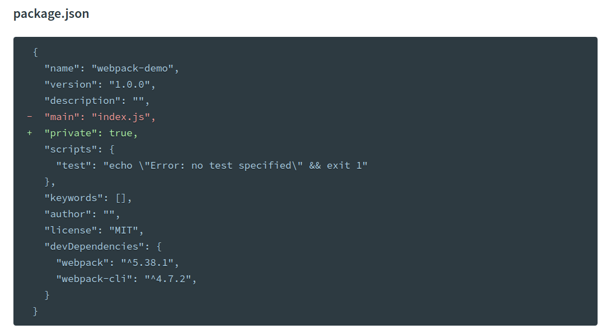
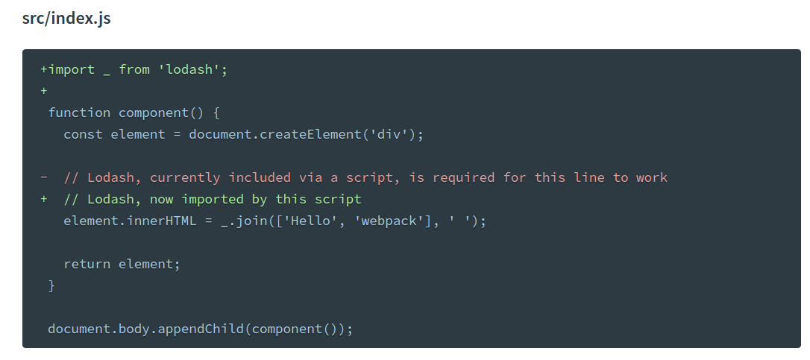
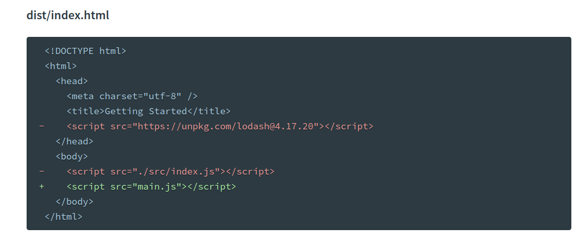
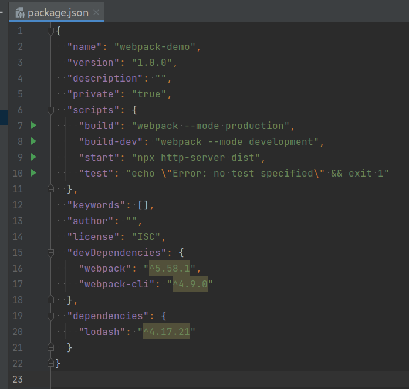
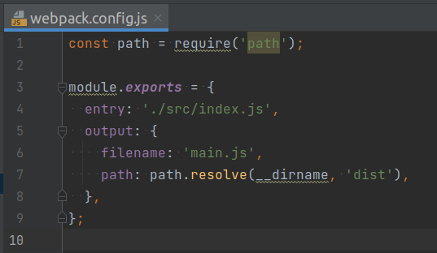
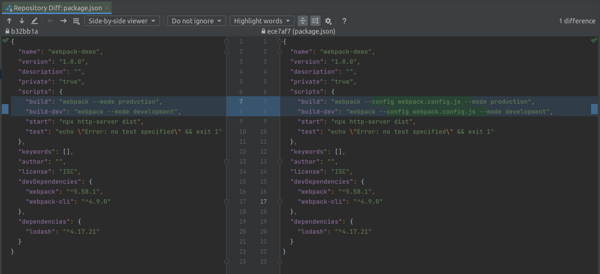
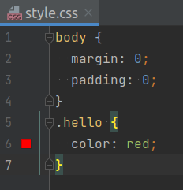
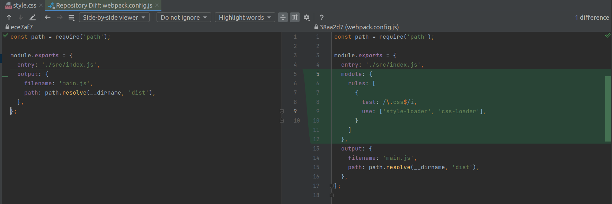
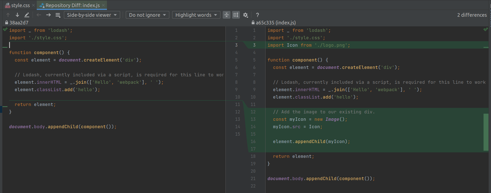

#webpack-demo

_Template for adding webpack bundler_

## Step 1 -- Add webpack

1. Clone to your local machine: `git clone https://github.com/it-zmina/webpack-demo.git`
2. Check that example working.
3. Init npm project manager (create `package.json` file): `npm init -y`
4. Install webpack bundler as dev dependency: `npm install webpack webpack-cli --save-dev`
5. Move `index.html` file to the `dist` folder.
6. Install `loadsh` module locally: `npm install --save lodash`
7. Remove `main` and add `private` fields as shown at the next picture: 
8. Add import section for `loadsh` module: 
9. Remove remote module and rename main script (entry point): 
10. Add scripts for convenience: 

## Step 2 -- Add webpack configuration

1. Add `webpack.config.js` file to the project root folder: 
2. Update `scripts` section at the `package.json`: 

## Step 3 -- Loading Styles

1. Install style loader as dev dependency: `npm install --save-dev style-loader css-loader`
2. Add file with styles: 
3. Import file with style and change `
` element class property at the `index.js`: 
4. Update `webpack.config.js`: 

## Step 4 -- Loading Images

1. Add rule to the `webpack.config.js`: 
2. Add image to the application (`index.js`): 